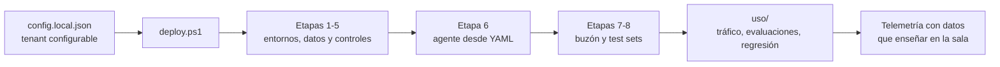

# Demos — De la jungla de agentes al control plane

Despliegue reproducible del escenario FraSoHome para las cuatro demos de la sesión del
Bizz Summit Madrid 2026. Un solo proceso de negocio —devoluciones omnicanal— atraviesa
las cuatro, así que todo el escenario se levanta de una vez.

El tenant de destino sale de `config.local.json`. El mismo repositorio sirve para el tenant
de demo, para uno de pruebas y para un ensayo en otro sitio, sin tocar una línea de código.

## Qué despliega

| Etapa | Objeto | Para qué demo |
|---|---|---|
| 1 | Entorno **FraSoHome-Plataforma** y localización del **Default** | 1 y 4 |
| 2 | Sitios `FraSoHome-KB-Operaciones` y `FraSoHome-PrevencionPerdidas`, con los 9 documentos FS-KB y el confidencial FS-KB-11 | 1, 2 y 3 |
| 3 | Etiqueta **Confidencial – Prevención de Pérdidas** con cifrado, y **DLP de Purview** que bloquea IBAN | 2 |
| 4 | Tablas de Dataverse desde los CSV de `01_datos`, más la fila `DEV-2026-0418` con su IBAN | 2 |
| 5 | Política de datos con **endpoint filtering** sobre el knowledge source de SharePoint | 2 |
| 6 | El agente **Asistente de Devoluciones FraSoHome**, desde YAML con `pac copilot` | 1, 2 y 3 |
| 7 | Buzón compartido `devoluciones@frasohome.es` con 18 reclamaciones sembradas | 4 |
| 8 | Los tres test sets: 10 documentales + 6 métricos + 4 de seguridad = **20 casos** | 3 |



Dos cosas que **no** hace, y son deliberadas:

- **No endurece el entorno Default.** El agente vive ahí, sin Managed Environment y sin
  propietario nombrado. Ese desorden es el hallazgo de la demo 1: si lo arreglas, no hay demo.
- **No aplica la regresión de la demo 3.** Eso lo hace `uso/Set-RegresionVersionado.ps1`,
  y conviene lanzarlo el 1 de octubre para que el Change Tracker enseñe un cambio reciente.

## Requisitos previos

- **PowerShell 7** y **Azure CLI**, con `az login` contra el tenant correcto
- **Power Platform CLI** (`pac`)
- Módulos: `Microsoft.PowerApps.Administration.PowerShell`, `Microsoft.Graph.Sites`,
  `Microsoft.Graph.Files`, `Microsoft.Graph.Users.Actions`, `ExchangeOnlineManagement`
- El material de FraSoHome accesible en disco (`datos.raizFraSoHome`)
- Roles: **Power Platform Administrator** para las etapas 1, 4, 5 y 6;
  **Compliance Administrator** para la 3; **Exchange Administrator** para la 7

Las etapas 3 y 7 se intentan de verdad. Si faltan permisos, el paso se anota en un runbook
manual con el comando exacto ya relleno desde tu configuración, y el despliegue continúa.
El runbook aparece en `99_local/bizzsummit-2026/runbook-manual.md`.

## Despliegue

```powershell
Copy-Item .\config.example.json .\config.local.json
# Edita config.local.json: tenant.id, tenant.domain, los UPN de las personas
# y datos.raizFraSoHome

# 1. Valida el repositorio sin tocar el tenant
pwsh .\tests\Test-Repositorio.ps1
pwsh .\deploy.ps1 -ConfigPath .\config.local.json -ValidateOnly

# 2. Ensaya el despliegue completo sin escribir nada
pwsh .\deploy.ps1 -ConfigPath .\config.local.json -Stage 8 -WhatIf

# 3. Despliega
pwsh .\deploy.ps1 -ConfigPath .\config.local.json -Stage 8
```

Es idempotente: reutiliza lo que ya existe con el mismo nombre y solo crea lo que falta.
Los identificadores quedan en `99_local/bizzsummit-2026/deployment-state.json`, fuera de
control de versiones, y son lo que `cleanup.ps1` usa para saber qué es suyo.

Para reintentar una sola etapa:

```powershell
pwsh .\deploy.ps1 -ConfigPath .\config.local.json -OnlyStage 5
```

## Datos que enseñar — la parte que se olvida

Un agente recién desplegado sale en blanco en Usage, en Monitor y en la columna `Risks`.
Una sesión sobre inventario y gobierno con todos los contadores a cero no se sostiene.

```powershell
# Una semana antes: tráfico real contra el agente, repartido en varios días
pwsh .\uso\Invoke-TraficoAgente.ps1 -ConfigPath .\config.local.json -Conversaciones 40

# Vuelve a lanzarlo a diario hasta el evento. La gráfica con un único pico se nota.
```

| Script | Qué hace | Cuándo |
|---|---|---|
| `uso/Invoke-TraficoAgente.ps1` | Conversaciones por Direct Line con 20 preguntas reales del proceso | A diario, desde una semana antes |
| `uso/Send-CorreosDevolucion.ps1` | Siembra el buzón con 18 reclamaciones, incluido el patrón anómalo de cuatro correos del mismo cliente | Una vez, y de nuevo si se vacía |
| `uso/Invoke-Evaluaciones.ps1` | Ejecuta los 20 casos y compara con la línea base | Antes con `-GuardarLineaBase`, y el día de la demo |
| `uso/Set-RegresionVersionado.ps1` | Borra la regla de versionado y publica: 45 días pasan a 30 | **El 1 de octubre**, con la cuenta de Marta |

La secuencia completa de la demo 3:

```powershell
# Antes: la foto en verde
pwsh .\uso\Invoke-Evaluaciones.ps1 -ConfigPath .\config.local.json -GuardarLineaBase

# El 1 de octubre: romper a propósito
pwsh .\uso\Set-RegresionVersionado.ps1 -ConfigPath .\config.local.json -Aplicar

# Comprobar que de verdad está roto. No lo supongas.
pwsh .\uso\Invoke-Evaluaciones.ps1 -ConfigPath .\config.local.json
#   Esperado: 19 verde / 1 rojo, con el plazo online devolviendo 30 días

# Después del evento
pwsh .\uso\Set-RegresionVersionado.ps1 -ConfigPath .\config.local.json -Revertir
```

## El agente que no es de Microsoft

`agente-externo/fs-triage-devoluciones/` es el protagonista de la demo 4: un agente en
**Claude Agent SDK** que triaja el buzón y que arranca sin identidad, sin telemetría y sin
propietario. Tiene su propio README con los tres beats y el aviso sobre permisos delegados.

**Ensáyalo y deja el repositorio limpio.** Si llegas al escenario con el agente ya
instrumentado, la demo 4 no tiene nada que enseñar.

## Limpieza

```powershell
pwsh .\cleanup.ps1 -ConfigPath .\config.local.json -WhatIf
pwsh .\cleanup.ps1 -ConfigPath .\config.local.json
```

Borra solo lo que creó el despliegue. Los sitios de SharePoint y el entorno de plataforma
se conservan salvo que lo pidas expresamente (`-EliminarEntornoPlataforma`). El entorno
Default no se toca nunca.

## Estructura

```text
demos/
├─ deploy.ps1                  orquestador de las ocho etapas
├─ cleanup.ps1                 deshace lo propio, respeta lo reutilizado
├─ config.example.json         plantilla; el tenant se cambia aquí
├─ scripts/
│  ├─ Common.psm1              config, registro, estado y runbook
│  ├─ Dataverse.psm1           tablas y carga por Web API, con esquema inferido del CSV
│  └─ stages/                  Stage1 … Stage8
├─ agente/                     proyecto YAML del agente de Copilot Studio
│  ├─ instrucciones.md         incluye la regla de versionado que la demo 3 borra
│  ├─ knowledge/               fuente de conocimiento de SharePoint
│  └─ topics/                  plazo, métricas y escalado por fraude
├─ datos/
│  ├─ dataverse/               destino de los CSV procesados
│  ├─ buzon/correos.json       18 reclamaciones de siembra
│  ├─ kb/                      generador de FS-KB-11, el documento confidencial
│  └─ testsets/                el test set de seguridad, 4 casos
├─ uso/                        los cuatro scripts de uso
├─ agente-externo/             fs-triage-devoluciones (Python)
└─ tests/Test-Repositorio.ps1  validación local, sin tenant
```

## Notas honestas

Tres cosas dependen de superficies que siguen en preview y pueden haber cambiado cuando
leas esto:

- **La API de evaluaciones de Copilot Studio.** Su ruta está en `config.evaluaciones.apiRoot`,
  no incrustada en el código. Si Microsoft la mueve, se toca un valor. Si falla, la etapa 8
  no rompe el despliegue: genera runbook para importar los CSV desde la interfaz.
- **Advanced Connector Policies.** La etapa 5 usa DLP clásica con endpoint filtering, que es
  lo que hoy funciona por entorno individual. Las ACP siguen siendo por environment group.
- **El esquema de `connectorConfigurations`.** Comprueba con
  `Get-Help New-PowerAppDlpPolicyConnectorConfigurations -Examples` que la forma no ha cambiado
  antes de fiarte de la etapa 5 en un tenant nuevo.

Y una que no es de preview sino de física: **la propagación de políticas de Purview tarda**.
Ejecuta la etapa 3 con una semana de margen y comprueba el bloqueo en la sala la mañana del
evento. Si a las 10:30 no bloquea, va el vídeo.
