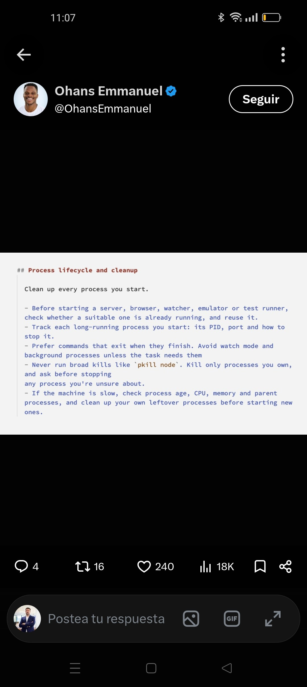

Seminario conjunto con Eladio Rincón y Miguel Egea. Como condensar más de 75 años de experiencia combinada en 4 horas. Daremos las claves para configurar un marco de trabajo basado en IA Generativa para proyectos de Ingeniería de Datos y Analítica en general, con demos basadas en Microsoft Fabric y Microsoft Power BI. 
La idea sería mostrar cual debe de ser la estructura de un repositorio de código orientado a desarrollar una solución de este estilo ¿un repo? ¿varios? 
No discutiremos de Arquitectura. Utilizaremos el patrón de Medallón, aunque no siempre es la mejor opción, y el marco de trabajo debe de adaptarse claramente a diferentes patrones. Veremos como definir contratos entre capas, y como asegurarnos de que se aplican reglas de calidad que tengan sentido y cuando tengan sentido. 

Requisitos:
- Tu ordenador
- Visual Studio Code, Un Agente de Código (Claude Code, Codex, Github Copilot,...)
- Una suscripción de Microsoft Fabric

Veremos que skills utilizar, cuando crear las nuestras, al igual que ocurre con los MCP. 

Al final del workshop, te llevarás un sistema funcionando, auditables, trazable, y que podrás utilizar para tus futuros proyectos

Poco PowerPoint y muchas historias abuelo cebolleta. 

Miguel.egea@gmail.com
eladio.rincon@gmail.com 
antoniosotorodriguez@gmail.com 

## Enlaces de interés
Apache Ossie: https://github.com/apache/ossie 
Plantilla de Proyecto: https://github.com/polmarza/project-template
De skill a pluging: https://x.com/startupideaspod/article/2090177246179045536 
compartir Skills: https://x.com/KSimback/status/2092565062850318824
sistema de varios agentes: https://gist.github.com/antoniolg/4a38aba6f4e4d7447cdd986b71a5ee1b 
Matar los procesos: 

https://medium.com/@dr.jarkko.moilanen/from-odps-to-mcp-how-dawiso-brings-data-product-context-to-ai-agents-in-databricks-c4e9bb944a9d 

https://github.com/resources/insights/agentic-engineering-system

https://medium.com/illumination/microsoft-blocked-a-databricks-integration-the-real-battle-is-over-enterprise-ai-176305dac956

https://github.com/pawarbi/fabric-rlm-core

https://learn.microsoft.com/es-es/fabric/data-factory/connector-clickhouse
https://clickhouse.com/blog/clickhouse-for-microsoft-fabric

Slim CI: https://snowpack-data.com/blog/slim-ci-for-dbt 